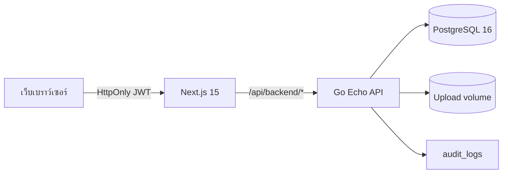
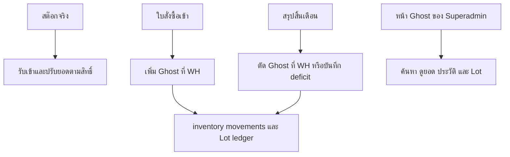
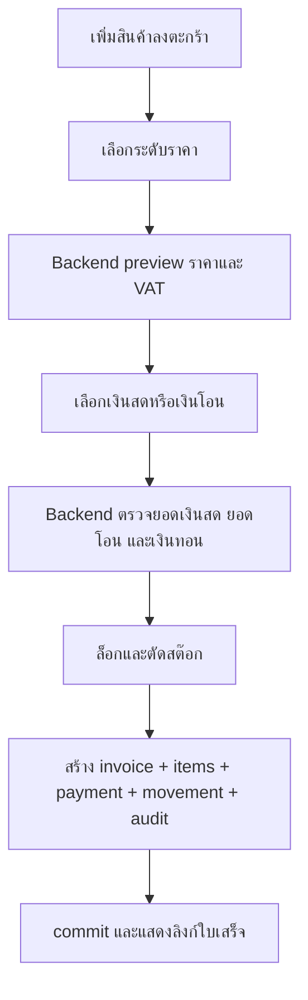

# สเปค Pharmacy ERP

อัปเดตล่าสุด: 2026-07-14

## 1. เป้าหมาย

ระบบรองรับร้านขายยาและอุปกรณ์การแพทย์หลายสาขา โดยมีหลักการสำคัญดังนี้

1. ราคา ภาษี สต๊อก เลขที่เอกสาร และการชำระเงินคำนวณที่ backend เท่านั้น
2. แยกสต๊อกจริงต่อสาขาและสต๊อกผีเป็น bucket ภายใน WH
3. ยอด inventory ต้องเท่ากับผลรวม inventory movements เสมอ
4. POS ต้องขายและรับชำระใน transaction เดียว
5. ระบบมีเพียงผู้ดูแลระบบและพนักงานขายหน้าร้าน
6. ทุกหน้าจอและข้อความสำหรับผู้ใช้เป็นภาษาไทย
7. ข้อมูลที่เลือก “ลบถาวร” ต้องลบข้อมูลเกี่ยวข้องตามผลกระทบที่แสดงก่อนยืนยัน

## 2. บทบาท

| บทบาท | ขอบเขต | เมนู |
|---|---|---|
| `super_admin` | ทุกสาขา | แดชบอร์ด, สินค้าและการโอน, สต๊อกจริง, สต๊อกผี, สรุปสิ้นเดือน, การขายและเอกสาร, ผ่อนชำระ, การเงิน, บัญชีภายนอก, รายงาน, ตั้งค่า |
| `branch_pos` | สาขาที่ผูกกับบัญชี | ขายหน้าร้าน, ประวัติ, เช็กสต๊อก, รับโอนสินค้า, ผ่อนชำระ, สรุปยอดขาย |

Backend เป็นผู้ส่ง navigation ตาม role และ frontend ตรวจ role ซ้ำก่อน render หน้า

## 3. สถาปัตยกรรม

- Frontend เป็น thin client ไม่เก็บข้อมูลธุรกิจใน Local Storage
- API mutation ใช้ database transaction
- งานตัดสต๊อกใช้ `SELECT ... FOR UPDATE`
- Migration ถูก embed ใน backend binary และรันก่อนเปิด API
- รูปสินค้าเก็บใน upload volume ส่วน metadata เก็บใน products

## 4. UX/UI

### ผู้ดูแลระบบ

- พื้นหลังสีครีมอ่อน การ์ดสีขาว มุมโค้ง
- สีหลักแดง เหลือง และดำ
- sidebar ซ้ายบน desktop ย่อเหลือเฉพาะไอคอนได้ และเมนูแนวนอนบนมือถือ
- หน้า dashboard และหน้าจัดการใช้ metric cards, tabs, table และ dialog ยืนยัน
- หน้าสินค้า สต๊อกจริง และสต๊อกผีใช้ master-detail: รายการแบบหนาแน่นด้านซ้าย รายละเอียดที่เลือกด้านขวา ค้นหา/กรอง/แบ่งหน้าฝั่ง server ครั้งละ 50 รายการ

### พนักงานขายหน้าร้าน

- ใช้ top navigation แบบโปรแกรมแคชเชียร์
- หน้า POS สูงเต็ม viewport โดยเลื่อนเฉพาะ grid รายการสินค้า ตะกร้าคงที่บน desktop และเปิดเป็น panel บน mobile
- ฝั่งซ้ายเป็นค้นหา หมวด และ grid สินค้า 3 คอลัมน์ที่มีรูป ราคา และยอดสต๊อกจริง
- ฝั่งขวาเป็นตะกร้าปัจจุบัน ลูกค้า ยอดรวม และปุ่มรับชำระ
- รายการขายย้อนหลังแยกเป็นเมนู **ประวัติ**
- รองรับเงินสดพร้อมคำนวณเงินทอน เงินโอนพร้อมเลขอ้างอิง และเงินสดผสมเงินโอน โดยบันทึกยอดรับแยกช่องทาง
- รองรับ desktop, tablet และ mobile

## 5. สินค้าและรูป

ข้อมูลสินค้า:

- SKU และบาร์โค้ดไม่ซ้ำ โดย SKU สร้างอัตโนมัติและผู้ใช้แก้ไขได้
- ชื่อ รายละเอียด หน่วยนับ หมวดสินค้า
- ราคาทุน ราคาสด ราคาปลีก ราคาผ่อน
- ยกเว้น VAT และสถานะใช้งาน
- รูป JPEG, PNG หรือ WebP ขนาดไม่เกิน 5 MB

ผู้ดูแลสามารถสร้าง แก้ไข อัปโหลด/เปลี่ยน/ลบรูป และลบสินค้าแบบถาวรได้

รหัสที่ผู้ใช้ต้องอ้างอิง เช่น SKU, รหัสสาขา, รหัสชื่อราชการ, เลขที่เช็ค และเลขใบโอน สร้างให้อัตโนมัติ รหัสที่อยู่ในฟอร์มสามารถแก้ไขก่อนบันทึกได้ ส่วน backend จะสร้างสำรองเมื่อ client ส่งค่าว่าง

## 6. สต๊อกจริงและสต๊อกผี

- สต๊อกจริงห้ามติดลบ ส่วน Ghost ติดลบได้เฉพาะ deficit จากสรุปสิ้นเดือน
- Superadmin ใช้เมนู **สต๊อกจริง** และ **สต๊อกผี** แยกจากกัน หน้าสต๊อกผีไม่มี dropdown สาขา ราคา ส่วนลด จุดเตือน ปุ่มตั้งค่า ปรับยอด หรือลบสินค้า
- ปริมาณ Ghost เปลี่ยนได้เฉพาะใบสั่งซื้อเข้า (รวม correction/cancel) และ Month-End reconciliation; endpoint adjust, receive, rebalance และ receipt approval ปฏิเสธ Ghost
- เอกสารขาย ใบเสนอราคา ใบโอน และคืนสินค้าใช้ Real เท่านั้น
- POS รับเฉพาะข้อมูลสต๊อกจริง API จะไม่ส่ง field สต๊อกผี และ backend ปฏิเสธการขายสต๊อกผีแม้แก้ request เอง
- POS แจ้งรับสินค้าได้ในรูปคำขอ โดยเก็บ snapshot ยอดขณะส่ง ผู้ดูแลเห็น conflict เทียบยอดปัจจุบัน และอนุมัติเข้าสต๊อกจริงหรือปฏิเสธ
- migration 006 เติม opening balance ให้ฐาน legacy เพื่อให้ movement ledger ตรงกับยอดเดิม
- migration 007 แปลชื่อสิทธิ์ การตั้งค่า และข้อมูลตัวอย่างเดิมให้เป็นภาษาไทย
- การลบใบขายคืนสต๊อกตาม product, quantity และ bucket ของ invoice item

## 7. ราคาและเอกสาร

ลำดับการเลือกราคา:

1. ราคาที่ override โดยผู้มีสิทธิ์
2. ราคาชื่อสินค้าสำหรับราชการ
3. ราคาตามระดับ cash/retail/installment
4. ราคาสาขาหรือราคาฐาน

ใบเสนอราคาไม่ตัดสต๊อก เมื่อแปลงเป็นใบขายจึงตรวจและตัดสต๊อกจริง ใบขายทุกใบเก็บ cost snapshot, price source, VAT และเลขที่เอกสารจาก sequence ของสาขา

## 8. POS Checkout

หากขั้นตอนใดล้ม ทั้ง invoice, payment และ stock ต้อง rollback พร้อมกัน

POS และเอกสาร operational ทุกชนิดตัดได้เฉพาะสต๊อกจริง ส่วนสต๊อกผีเปลี่ยนผ่านใบสั่งซื้อเข้าและสรุปสิ้นเดือนเท่านั้น

การชำระแบบผสมบันทึก `invoice_payments` สองรายการ โดยยอดเงินสดสุทธิกับยอดเงินโอนรวมกันต้องเท่ากับยอดใบขาย และบังคับเลขอ้างอิงเมื่อมีเงินโอน

## 9. Hard Delete

ก่อนลบ ระบบเรียก deletion-impact และแสดงจำนวนข้อมูลเกี่ยวข้อง ผู้ใช้ต้องพิมพ์ข้อความ `ลบ ...` ให้ตรงก่อนปุ่มลบทำงาน

- สินค้า: ลบรูป, alias, ราคา, inventory, movements และรายการธุรกรรมที่เกี่ยวข้อง
- ใบขาย: คืนสต๊อก แล้วลบ items, payments, check mapping และ installment plan ที่เกี่ยวข้อง
- ใบขายที่ถูก snapshot ในกระดาษทำการปิดเดือนจะถูกล็อกไม่ให้ hard delete เพื่อรักษาหลักฐานและ source hash
- ใบเสนอราคา: หากแปลงแล้ว จะลบใบขายที่เชื่อมโยงพร้อมคืนสต๊อกก่อนลบใบเสนอราคา
- ผู้ใช้: ห้ามลบบัญชีตนเองและผู้ดูแลระบบคนสุดท้าย ข้อมูลผู้สร้างที่ผูกไว้ถูกลบตาม FK cascade และ inventory ถูก rebuild จาก ledger
- สาขา: ลบผู้ใช้ สต๊อก เอกสาร sequence และการโอนที่เกี่ยวข้อง

## 10. ผ่อนชำระ การเงิน และการโอน

- ผ่อนชำระ: POS ส่งคำขอ 1-60 เดือนจากใบขายค้างชำระ ผู้ดูแลอนุมัติหรือปฏิเสธ และระบบสร้างแผน/งวดจริงเฉพาะตอนอนุมัติ
- การเงิน: บันทึกเช็คและจับคู่กับใบขายค้างชำระ ยอดรวมต้องตรงกัน
- การโอน: Superadmin สร้างรายการหลายสินค้าและยืนยันส่งเพื่อตัดสต๊อกต้นทาง จากนั้น POS ปลายทางเทียบจำนวนที่ส่งกับจำนวนรับจริง แก้จำนวนและใส่เหตุผลเมื่อไม่ตรง ก่อนกด **รับสินค้าแล้ว** ระบบเพิ่มปลายทางตามจำนวนจริงและบันทึกส่วนต่าง ไม่มี QR หรือการรับด้วยรหัส
- สรุปยอดขาย: เลือกวันที่เริ่มต้น/สิ้นสุด ดูรายการทั้งช่วง และดาวน์โหลด PDF ภาษาไทยหรือ Excel `.xlsx` ได้

สาขามีประเภท **คลังหลัก** หรือ **สาขาหน้าร้าน** และสาขาหน้าร้านเลือกคลังหลักต้นสังกัดได้ การโอนยังเลือกจำนวนสินค้าเฉพาะส่วนที่ต้องการ ไม่บังคับโอนสต๊อกทั้งหมด

## 11. รายได้อื่นและสมุดงานบัญชีภายนอก

- Superadmin บันทึกและแก้ไขรายได้ที่ไม่มาจากใบขาย โดยระบุสาขา วันที่ หมวด รายละเอียด ช่องทางรับเงิน ยอด และเลขอ้างอิง
- การยกเลิกรายได้ใช้สถานะ `void` พร้อมเหตุผล ไม่ลบรายการ และรายงานไม่นำรายการยกเลิกมารวม
- สมุดงานเลือกช่วงวันที่และสาขา หรือรวมทุกสาขา แล้ว snapshot ยอดใบขาย รายได้อื่น และยอดรับเงินสด/โอน/เช็ค/อื่นๆ
- ผู้จัดทำปรับยอดรายได้และช่องทางรับเงินได้เฉพาะในสมุดงาน ต้องระบุเหตุผลเมื่อยอดปรับไม่เป็นศูนย์ การปรับไม่แก้ invoice, payment หรือ inventory ต้นฉบับ
- สัดส่วนเริ่มต้นคือออกเอกสาร 80% และอื่นๆ 20% แก้ได้ต่อสมุดงาน แต่ผลรวมต้องเท่ากับ 100%
- สมุดงานฉบับร่างเปิดกลับมาแก้และคำนวณ snapshot ใหม่ได้ เมื่อยืนยันแล้วจะล็อก หากผิดต้องยกเลิกพร้อมเหตุผลและสร้างฉบับใหม่
- หน้าพิมพ์แสดงยอดต้นฉบับ ยอดปรับ ยอดลงบัญชี ช่องทางรับเงิน สัดส่วน เหตุผล หมายเหตุ ผู้จัดทำ และช่องลงนาม
- Dashboard รวมรายได้อื่นกับยอดขายใน metric รายได้รวม และแจ้งจำนวนสมุดงานฉบับร่าง
- รายงานกำไรขาดทุนแยกยอดขาย รายได้อื่น รายได้รวม ต้นทุน และกำไรต่อสาขา
- ไม่รวมการดึงยอดขายจาก Ocha ในขอบเขตนี้

## 12. Acceptance Criteria

1. Login ได้เฉพาะสอง role และไม่สามารถเปิดหน้าข้าม role
2. ทุก navigation link เปิดหน้าได้โดยไม่มี server exception
3. logout ลบ cookie และกลับหน้า login
4. CRUD หลัก submit แล้วข้อมูลเปลี่ยนจริง
5. รูปสินค้ายังอยู่หลัง restart container
6. POS เห็นและขายได้เฉพาะสต๊อกจริง โดย API ปฏิเสธสต๊อกผี
7. เงินทอนมาจาก backend preview
8. hard delete invoice/quotation คืนสต๊อกครบ
9. inventory เท่ากับผลรวม movements ทุก bucket
10. `go test`, lint, build, audit และ Playwright ผ่านทั้งหมด
11. คำขอสต๊อกและผ่อนชำระไม่เปลี่ยนข้อมูลจริงก่อนผู้ดูแลอนุมัติ
12. รายงานช่วงวันที่ export เป็น PDF และ XLSX ที่เปิดใช้งานได้จริง
13. บันทึก แก้ไข และยกเลิกรายได้อื่นได้ โดยรายการยกเลิกไม่รวมใน Dashboard/รายงาน
14. สมุดงานคำนวณยอดต้นฉบับ ยอดปรับ และสัดส่วน 80/20 ถูกต้อง ผลรวมสัดส่วนเท่ากับยอดลงบัญชี
15. ยืนยันสมุดงานแล้วแก้ไขไม่ได้ และการยกเลิกต้องมีเหตุผล
16. หน้าพิมพ์สมุดงานเปิดได้และแยกยอดจริงออกจากยอดปรับชัดเจน
17. สาขาหน้าร้านเลือกคลังหลักต้นสังกัดได้ และการโอนบางส่วนยังทำงานครบวงจร
18. เมนูสต๊อกจริงและสต๊อกผีแยกหน้าจอ โดยหน้า Ghost เป็น read-only และเปลี่ยนยอดได้เฉพาะ PO/Month-End
19. สรุปสิ้นเดือนเลือกช่วงวันที่และสาขาขาย บิล `issued + paid + cash only + ไม่ขอใบกำกับเต็มรูป + ยังไม่ถูกซ่อน` จะถูกซ่อนเฉพาะเมื่อ Ghost Stock ที่ WH ครอบคลุมทุกบรรทัด ส่วนบิลเงินสดที่ Ghost ไม่พอจะคงอยู่แต่บันทึกที่ต้นทุน × (1 + 5–10%) และยอดเป้าหมาย = บิลไม่เข้าเงื่อนไข (โอน/ผสม/ใบกำกับเต็มรูป) + บิลที่บันทึกใหม่
20. รอบใหม่ไม่ใช้ยอดเป้าหมายหรือเปอร์เซ็นต์ปรับราคา ช่องเดิมเป็น Legacy disabled; รายงานยังอ่าน price log ของรอบเดิมได้
21. การยืนยันรอบย้อน Real เดิม, ส่ง Real จากสาขาคืน WH, รับ WH Real และตัด WH Ghost จำนวนเท่ากัน; หาก Ghost ไม่พอให้ติดลบผ่าน immutable deficit ledger

## 13. สรุปสิ้นเดือนและการควบคุมข้อมูล

1. เฉพาะ `super_admin` เลือกวันเริ่มต้น–สิ้นสุดและหนึ่งหรือหลายสาขาขาย; เลือก WH เป็นสาขาต้นทางไม่ได้
2. Preview แสดงบิลที่จะซ่อน (เงินสดที่ Ghost Stock ที่ WH ครอบคลุมทุกบรรทัด), บิลที่จะบันทึกที่ต้นทุน × (1 + 5–10%) (เงินสดที่ Ghost ไม่พอ), ยอดเป้าหมายที่คำนวณ และ projection ของ Branch Real returned, WH Real received, WH Ghost deducted และ deficit
3. ใบกำกับภาษีเต็มรูป, เงินโอน, ชำระผสม, unpaid, cancelled และบิลที่ซ่อนแล้วไม่เข้า candidate
4. ขั้นยืนยันทำงานใน transaction พร้อม advisory lock และปฏิเสธช่วงวันที่ทับซ้อนต่อสาขา
5. บิลที่ซ่อนถูก soft-delete, บิลที่บันทึกที่ต้นทุน + % ถูกแก้ราคาบรรทัด/ยอดบิล/ยอดชำระเงินสดพร้อม log `price_adjusted` และ `invoice_repriced`, snapshot Before ถูกเก็บ, และเลขบิล Active ที่เหลือเรียงใหม่ตาม `created_at, id` โดย timestamp ไม่เปลี่ยนจากการ renumber
6. แหล่งตัด effective ของบิลที่ซ่อนเป็น Ghost ค่าเดียว ส่วน Real reversal/return/receive เป็น adjustment แยก
7. รายงานใช้ `reconciliation_id` เป็นตัวกรองหลัก แสดง Before/After, movement detail และผลรวม Real/Ghost/deficit
8. Ghost Lots และ PO มีได้เฉพาะ WH; Ghost movement ใหม่ต้องอ้างอิง PO หรือ Month-End ส่วน adjustment, receive, rebalance, receipt approval และเอกสารขาย/เสนอราคา/โอน/คืนทั่วไปใช้ Real เท่านั้น
