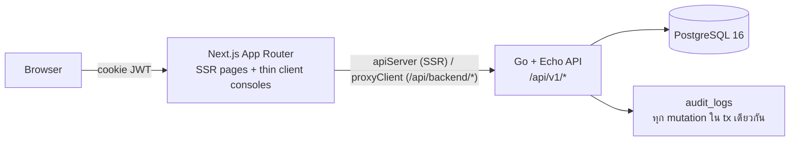
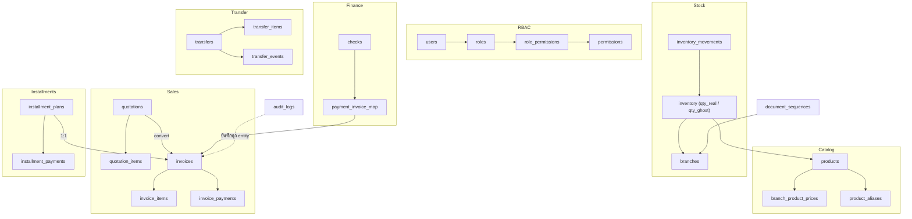
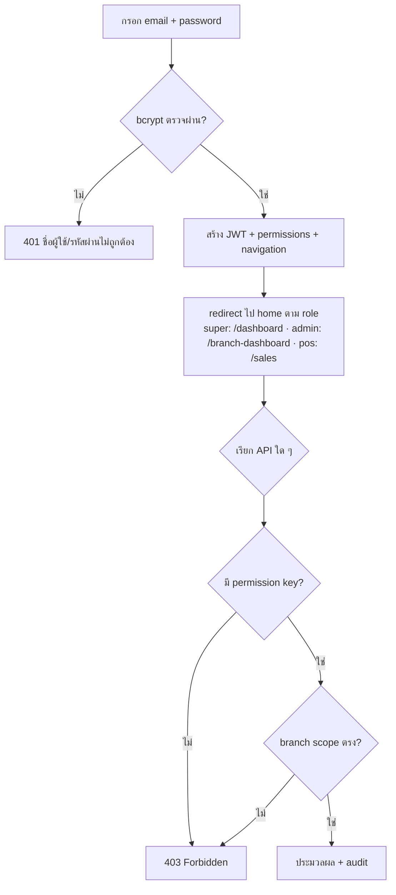
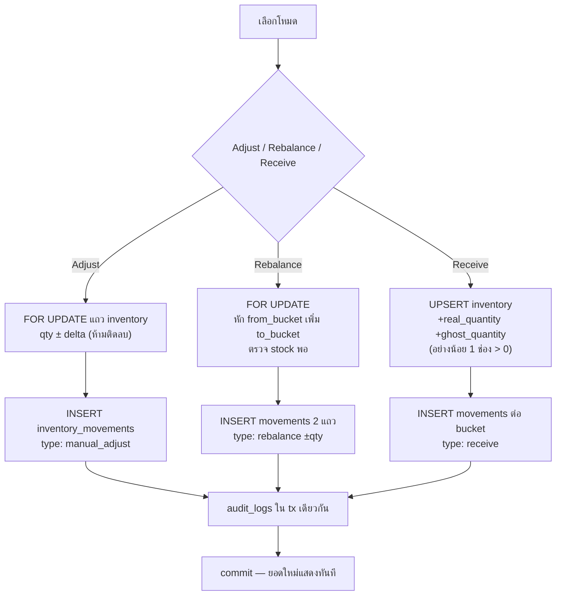
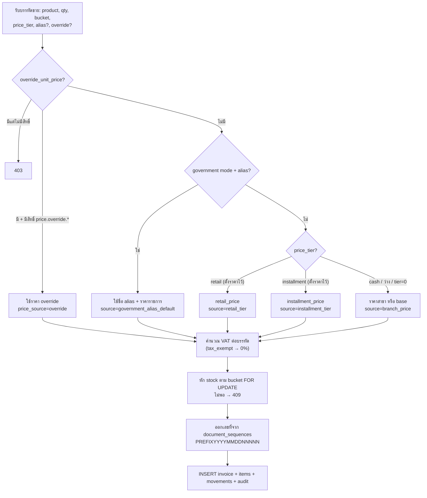
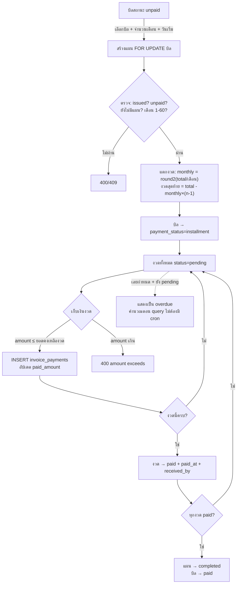
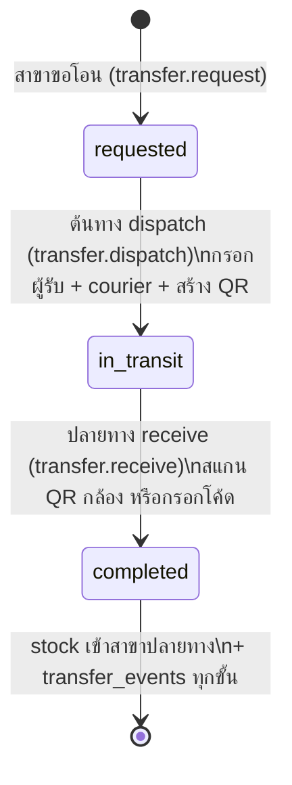

# สเปคโปรแกรม Pharmacy ERP (ฉบับเต็มทั้งระบบ)

> จัดทำ: 2026-07-11 · อ้างอิงจากโค้ดจริงทั้งหมด (backend Go + frontend Next.js) · flowchart เป็น Mermaid (GitHub render ได้)
> เอกสารคู่กัน: [MANUAL_TEST_CASES.md](MANUAL_TEST_CASES.md)

---

## 1. Problem Statement

ร้านขายยา/อุปกรณ์การแพทย์ที่มีหลายสาขาต้องบริหาร stock 2 ประเภท (stock จริงที่ตรวจสอบได้ กับ stock ผีสำหรับขายเงินสด) ออกบิลหลายรูปแบบ (เงินสด, ขายปลีก, ผ่อนงวด, โหมดหน่วยงานราชการ รพสต.) และต้องมี audit trail ครบทุกธุรกรรมเพื่อการตรวจสอบ ระบบเดิม (Google Sheets / DockBill) ไม่มี transaction safety, ไม่เช็ค stock ติดลบ, ไม่มี VAT และเลขที่เอกสารไม่ต่อเนื่อง — เสี่ยงทั้งด้านบัญชีและกฎหมาย

## 2. Goals / Non-Goals

**Goals**
1. ทุกธุรกรรมการเงิน/สต๊อกคำนวณและบันทึกที่ backend เท่านั้น พร้อม audit log 100%
2. บริหาร stock จริง/ผี แยกกันได้ต่อสาขา โดย movement log reconcile ตรงกับยอดคงเหลือเสมอ
3. ออกบิลได้ 4 แบบราคา (cash/retail/installment/government) เลขที่เอกสารรันต่อเนื่องต่อสาขาและล็อกได้
4. รองรับขายผ่อน: แตกงวดอัตโนมัติ ผลรวมงวด = ยอดบิลเสมอ ติดตามงวดค้าง/เลยกำหนด
5. แยกสิทธิ์ 3 บทบาทเด็ดขาด (super_admin / branch_admin / branch_pos) ทั้ง UI และ API

**Non-Goals**
- ไม่ทำ e-commerce/หน้าร้านออนไลน์ (marketplace เป็นแค่ inbox รับออเดอร์)
- ไม่ทำระบบบัญชีแยกประเภท (GL) — ส่งออกรายงานภาษี/กำไรขาดทุนพอ
- ไม่ import ข้อมูลลูกค้าเก่าจาก Google Sheets (ตัดสินใจ 2026-07-11; mapping เก็บไว้ใน DOCKBILL_MERGE_ANALYSIS.md)
- ไม่มี mobile app — ใช้ responsive web
- ไม่เชื่อม API จริงของ marketplace ภายนอก (โครงสร้าง connection รองรับไว้แล้ว = P2)

## 3. ผู้ใช้และบทบาท

| Role | ผู้ใช้ seed | ขอบเขต | หน้าที่ใช้ได้ |
|---|---|---|---|
| `super_admin` | superadmin@erp.local | ทุกสาขา | /dashboard, /inventory-management, /installments, /finance-central, /global-reports, /settings |
| `branch_admin` | branchadmin@erp.local | สาขาตัวเอง (มนัสการแพทย์) | /branch-dashboard, /branch-inventory, /sales-invoices, /installments, /local-finance |
| `branch_pos` | pos@erp.local | สาขาตัวเอง ขาย+เก็บเงิน | /sales, /inventory-check, /installments, /transfer-receipts, /daily-sales |

รหัสผ่านทุกบัญชี (dev): `DevPassword123!` · เมนู sidebar สร้างจาก backend (`navigationFor`) ตาม role — ไม่ hardcode ที่ frontend

## 4. สถาปัตยกรรม

**กติกา Backend-Centric:** frontend ห้ามคำนวณราคา/VAT/stock — ส่งข้อมูลดิบและ render ผลจาก backend เท่านั้น; ทุก mutation ใช้ `WithTx` + `SELECT ... FOR UPDATE` + audit log ใน transaction เดียวกัน; migrations embed ใน binary รันอัตโนมัติก่อน serve

## 5. Data Model (ตารางหลัก 29 ตาราง)

จุดสำคัญ: `invoices.payment_status ∈ {unpaid, paid, installment}` · `inventory_movements.stock_bucket ∈ {real, ghost}` · `products` มีราคา 3 ระดับ: `base_selling_price` (cash), `retail_price`, `installment_price` (0 = ไม่ตั้ง ใช้ราคา base/สาขาแทน)

## 6. ฟีเจอร์และ Flowchart

### F1 — Authentication & RBAC

ผู้ใช้ login ด้วย email/password → backend ตรวจ bcrypt → คืน JWT + navigation ตาม role → frontend เก็บใน HttpOnly cookie ทุก request ต่อไปแนบ Bearer token; ทุก route มี `RequireAnyPermission`

**Acceptance:** login ผิด → error ไทย; ทุก role เข้าหน้าที่ไม่ใช่ของตัวเองไม่ได้ (redirect/refuse); ปุ่ม/เมนูแสดงตาม permission จริง

### F2 — Dual Inventory (Stock จริง + Stock ผี)

การกระทำ 3 แบบบนคู่ (สาขา, สินค้า): **Adjust** (บวก/ลบทีละ bucket), **Rebalance** (ย้ายระหว่าง real↔ghost), **Receive** (รับเข้าครั้งเดียวแยก 2 bucket)

**กติกา:** stock ติดลบ = 409; branch_admin ทำได้เฉพาะสาขาตัวเอง; `SUM(movements) = ยอดคงเหลือ` เสมอ
**Permissions:** adjust: `inventory.manage.*` · rebalance: `inventory.rebalance` · receive: `inventory.receive` (POS ไม่มีทั้งสาม — ดูได้อย่างเดียว)

### F3 — Product Catalog & Government Alias

สินค้ามีราคา 3 ระดับ + ราคา override ต่อสาขา (`branch_product_prices`) + alias สำหรับโหมดราชการ (ชื่อที่แสดงบนบิล + ราคาราชการ)

**Acceptance:** สร้าง/แก้สินค้าได้เฉพาะ `products.manage` (super admin); alias สร้างได้เฉพาะ `government.manage_alias`; SKU ซ้ำ → error

### F4 — Sales & Pricing Engine (Quotation / Invoice)

ราคาแต่ละบรรทัดตัดสินที่ backend ตามลำดับความสำคัญ:

Quotation flow เหมือนกันแต่ไม่หัก stock ไม่ออกเลขบิล — เมื่อ **Convert** จึงหัก stock และออกเลขบิลจริง (quotation → `converted`)

**Acceptance:** Preview แสดงราคาตรงกับที่บันทึกจริงเสมอ; ขายเกิน stock → 409 พร้อมข้อความ; ทุกบรรทัดบันทึก `price_source` + `cost_snapshot`

### F5 — Invoice Management

รายการบิล / รายละเอียด / พิมพ์ (หน้า `/print/invoices/:id`) / เก็บเงินเต็มใบ (`POST /invoices/:id/pay` — เฉพาะ role `branch_pos` ตาม business rule `validatePaymentCollector`) · เลขที่บิลออกจาก `document_sequences` ล็อกด้วย `is_locked` ได้จาก Settings

### F6 — Installment Billing (บิลผ่อน/งวด)

**Permissions:** ดู: ทุก role · สร้างแผน: `installment.manage` (super/admin) · เก็บเงิน: `installment.collect` (ทุก role)
**Acceptance:** ผลรวมงวด = ยอดบิลเสมอ (ทศนิยม 2 ตำแหน่ง); แผนซ้ำต่อบิล → 409; จ่ายบางส่วนได้; dashboard สรุป plan_count / outstanding_total / overdue_count

### F7 — Stock Transfers (โอนของระหว่างสาขา)

**Acceptance:** ทุกการเปลี่ยนสถานะเพิ่ม `transfer_events`; รับด้วยโค้ดผิด → error; POS รับของได้อย่างเดียว (`transfer.receive`)

### F8 — Finance: เช็คและการตัดชำระ

สร้างเช็ครับจากลูกค้า (pending) → ดูบิลค้างชำระ → Preview การตัด → Apply: สร้าง `payment_invoice_map` + `invoice_payments (check)` + บิลเป็น paid + เช็คเป็น applied · Local Finance = ขอบเขตสาขา, Finance Central = ทุกสาขา

### F9 — Dashboards & Reports

- Super admin `/dashboard`: ยอดขาย/stock รวมทุกสาขา · Branch admin `/branch-dashboard`: เฉพาะสาขา · POS `/daily-sales`: ยอดขายตัวเองรายวัน
- `/global-reports`: รายงานภาษี (จาก invoice_items จริง) + กำไร/ขาดทุน (ใช้ cost_snapshot)

### F10 — Settings (super admin)

จัดการ: สาขา / ผู้ใช้ (+reset password) / roles + permission mapping / document sequences (แก้ prefix, เลขถัดไป, ล็อก) / marketplace connection / ดู audit logs

### F11 — Marketplace Inbox

โครงสร้างรับออเดอร์จาก provider ภายนอก (seed: Health Mart) — ดู provider/orders ได้, upsert connection ได้ (`marketplace.manage.global`) · การเชื่อม API จริง = P2

## 7. Permission Matrix (สรุป)

| Permission | super | admin | pos |
|---|---|---|---|
| products.manage / government.manage_alias | ✅ | — | — |
| products.view | ✅ | ✅ | ✅ |
| inventory.manage.global | ✅ | — | — |
| inventory.manage.branch / view.branch | — | ✅ | view เท่านั้น |
| inventory.rebalance / inventory.receive | ✅ | ✅ | — |
| quotation.manage | ✅ | ✅ | — |
| invoice.create.branch | — | ✅ | — |
| invoice.create.pos / payment.collect | — | — | ✅ |
| invoice.view / reprint | ✅ | ✅ | view ✅ |
| installment.view | ✅ | ✅ | ✅ |
| installment.manage | ✅ | ✅ | — |
| installment.collect | ✅ | ✅ | ✅ |
| transfer.request / dispatch | ✅approve | ✅ | — |
| transfer.receive | ✅ | — | ✅ |
| finance.manage.global | ✅ | — | — |
| finance.manage.branch | — | ✅ | — |
| reports.view.global / settings.manage / users.manage / audit.view.global | ✅ | — | — |
| government.use | ✅ | ✅ | ✅ |
| price.override.global/branch/pos | ✅g | ✅b | ✅pos |

## 8. API Summary

| Method+Path | ฟีเจอร์ |
|---|---|
| POST /auth/login, /auth/logout · GET /me | F1 |
| GET /dashboard, /dashboard/daily-sales | F9 |
| GET/POST /products, PUT /products/:id · GET/POST /aliases | F3 |
| GET /inventory · POST /inventory/adjust, /rebalance, /receive | F2 |
| POST /quotations(/preview), /:id/convert · GET /quotations | F4 |
| POST /invoices(/preview) · GET /invoices(/:id)(/print) · POST /:id/pay | F4, F5 |
| GET/POST /installments · POST /installments/payments/:id/pay | F6 |
| GET/POST /transfers · POST /:id/dispatch, /:id/receive, /receive-by-code | F7 |
| GET/POST /checks · GET /checks/outstanding-invoices · POST /checks/preview-apply | F8 |
| GET /reports/tax, /reports/profit-loss | F9 |
| /branches, /users, /roles, /permissions, /branches/sequences | F10 |
| GET /marketplace/providers, /orders · POST /connections | F11 |
| GET /audit-logs | F10 |

## 9. Success Metrics

**Leading:** ออกบิลสำเร็จโดยไม่มี error ≥ 99%; เวลาสร้างบิล ≤ 60 วิ; movement log reconcile ตรงยอด 100% (ตรวจด้วย SQL ทุกคืนได้)
**Lagging:** งวดค้างชำระถูกติดตาม (overdue ปรากฏบน dashboard ภายใน 1 วัน); audit ครอบคลุมทุก mutation (สุ่มตรวจรายเดือน); ปิดการใช้ Google Sheets ได้ถาวร

## 10. Open Questions

- (บัญชี) บิลผ่อนต้องออกใบกำกับภาษีต่องวดหรือใบเดียวตอนออกบิล? — ปัจจุบันออกใบเดียว VAT เต็มตอนออกบิล
- (ธุรกิจ) นโยบายยกเลิกแผนผ่อน (`cancelled` มีใน schema แต่ยังไม่มี endpoint) — P1
- (Infra) การ backup PostgreSQL production — ต้องกำหนดก่อน go-live

## 11. Phasing

- **P0 (เสร็จแล้วทั้งหมด):** ทุกฟีเจอร์ในข้อ 6
- **P1:** ยกเลิกแผนผ่อน, รายงานงวดค้างรายลูกค้า, แจ้งเตือนงวดใกล้ครบกำหนด
- **P2:** เชื่อม marketplace API จริง, import ลูกค้าเก่า (ถ้าเปลี่ยนใจ), แอปมือถือ
