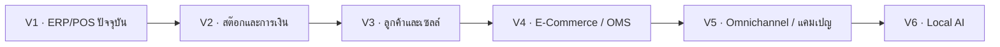

# แผนพัฒนา Pharmacy ERP: Version 1–6

บันทึกเมื่อ **16 กันยายน 2026** ตามเป้าหมายของเจ้าของโครงการ และตรวจเทียบกับโค้ดที่ commit **`43e5ad4b8f47c2d2572d6b2c5ccf67b8cf7770cb`** (`Improve mobile Admin and POS usability`)

เอกสารชุดนี้เป็นความทรงจำของโครงการที่เก็บใน repository ใช้อ้างอิงข้ามการสนทนาและส่งต่องานได้ โดยไม่ต้องพึ่งความจำของผู้ช่วยในแชท

ล่าสุด: [V2 status 2026-10-09](v2-execution/STATUS_2026-10-09.md) · [ผลตรวจล่าสุด](v2-execution/VERIFICATION_2026-10-09.md) · [ส่วนขยาย V1 2026-10-10: สมาชิก แต้ม ราคาส่ง ขายเชื่อ](V1_EXTENSIONS_2026-10-10.md) · [QA หลายสาขา 2026-10-10](../qa/2026-10-10/REPORT.md) · [บท demo](../DEMO_GUIDE.md)

| เอกสาร | ใช้ทำอะไร |
| --- | --- |
| [V1_BASELINE.md](V1_BASELINE.md) | ทะเบียนความสามารถที่มีจริง ข้อจำกัด และสิ่งที่ถูกถอดออก ณ V1 |
| [GAP_MATRIX.md](GAP_MATRIX.md) | เทียบทุกเป้าหมายกับ V1 และระบุ Version/Phase ที่จะเติม |
| [ROADMAP.md](ROADMAP.md) | ลำดับงาน V2–V6 ผลส่งมอบ เกณฑ์จบ Phase และประมาณการ |
| [DECISIONS.md](DECISIONS.md) | สมมติฐาน ประเด็นตัดสินใจ และวิธีบันทึกรุ่นถัดไป |
| [SOURCE_MAP.md](SOURCE_MAP.md) | แผนที่โค้ด หน้าจอ migration และหลักฐานการตรวจ |
| [V2_AGENT_PLAYBOOK.md](V2_AGENT_PLAYBOOK.md) | ทีม agent 9 บทบาท วิธีมอบหมาย feedback และตรวจรับงาน |
| [V2_ACCEPTANCE_CHECKLIST.md](V2_ACCEPTANCE_CHECKLIST.md) | Checklist รายฟีเจอร์ V2-P0/P1/P2 และเกณฑ์ส่งมอบ |
| [V2_START_PROMPT.md](V2_START_PROMPT.md) | Prompt พร้อมใช้เมื่อสั่งเริ่มพัฒนา V2 ด้วย subagents |

ภาพรวมที่เสนอ:

| Version | ผลลัพธ์หลัก | สถานะ |
| --- | --- | --- |
| V1 | ERP หลายสาขา: POS สินค้า คลัง รับเข้า โอน เคลม รายงาน และหน้าจอมือถือ | บันทึกฐานโค้ดปัจจุบันแล้ว; มีข้อจำกัดตาม baseline |
| V2 | ทำฐานสต๊อก/หน่วย/ต้นทุนให้ครบ และเปิดขายส่ง เครดิต เช็ค ใบลดหนี้ | เสนอแผน |
| V3 | ลูกค้ากลาง สมาชิก เซลล์ภาคสนาม ส่งสินค้า และเตือนซื้อซ้ำ | เสนอแผน |
| V4 | เว็บ E-Commerce, OMS, รับชำระออนไลน์ และ Click & Collect | เสนอแผน |
| V5 | เชื่อม Marketplace/แอป แคมเปญ และกำไรแยกช่องทาง | เสนอแผน |
| V6 | AI ภายในองค์กร: ถามรายงาน แจ้งผ่าน LINE และช่วยทำงานตามสิทธิ์ | เสนอแผน |

**Version เป็นรุ่นส่งมอบทางธุรกิจ ส่วน Phase เป็นชุดงานภายในรุ่น** จบแต่ละ Phase ต้องมีผลทดสอบและงานทดลองใช้ก่อนเลื่อนสถานะ ไม่มี Phase ใดถือว่าเสร็จเพียงเพราะมีหน้าจอหรือตารางฐานข้อมูล

V1 ในที่นี้เป็นชื่อ baseline ทางธุรกิจ ไม่ได้เปลี่ยน `frontend/package.json` ซึ่งยังเป็น `0.1.0` และไม่ได้สร้าง Git tag, deployment หรือ snapshot ฐานข้อมูล production การระบุ commit ช่วยย้อนดูโค้ดได้ แต่ไม่ใช่การสำรองข้อมูลธุรกรรม

เอกสารเก่า เช่น `SPEC.md`, `business-flow.md` และข้อเสนอ Ocha มีข้อกำหนดหลายยุคปะปนกัน หากใช้ตรวจว่า V1 ทำอะไรได้ ให้เริ่มจาก baseline ชุดนี้และหลักฐานโค้ด ไม่ถือว่าข้อเสนอเก่าทุกข้อถูกพัฒนาแล้ว

เริ่มงานครั้งถัดไปด้วยข้อความ เช่น: **“อ่าน docs/versions/README.md และเริ่ม V2-P0 ตาม ROADMAP.md”** จากนั้นแตกเป็นงานย่อยและปรับสถานะในเอกสารตามผลจริง
