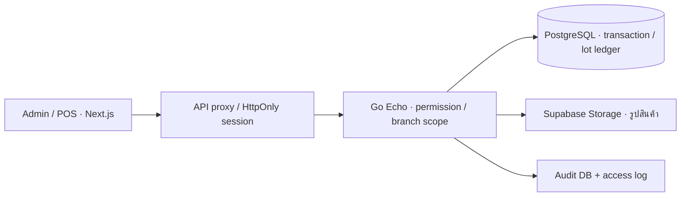

# แผนที่หลักฐานของ V1

ตรวจจาก commit `43e5ad4b8f47c2d2572d6b2c5ccf67b8cf7770cb` เมื่อ 2026-09-16 · [ทะเบียนฟีเจอร์](V1_BASELINE.md)

## ขอบเขตที่สำรวจ

ฐาน Git มี 1,116 ไฟล์ติดตาม, Go 98 ไฟล์รวม test, SQL migration 63 ไฟล์, frontend `page.tsx` 34 ไฟล์, Go test 41 ไฟล์ และ Playwright spec 8 ไฟล์ โค้ด Go/SQL รวม 32,335 บรรทัด และ frontend TS/TSX/CSS รวม 21,958 บรรทัด (รวม test/config ที่ใช้ส่วนขยายเหล่านี้) ตัวเลขเป็นขนาด source ณ baseline ไม่ใช่จำนวนฟีเจอร์

ตรวจรายการไฟล์ทั้งหมดด้วย Git/rg และอ่าน routing, schema evolution, business implementation, frontend entry points/services/components, tests และเอกสารที่เกี่ยวข้อง เน้นตรวจว่ามีการทำงานจริงและถูกเรียกใช้หรือไม่ ไม่ได้ตีความว่าอ่านทุกบรรทัดใน asset หรือทุกชุดข้อมูลส่วนบุคคลแล้ว ข้อมูลรูป/seed อธิบายเป็นแหล่งข้อมูล ไม่ได้นับภาพแต่ละไฟล์เป็นฟีเจอร์ ไม่มีการอ่าน secret environment หรือข้อมูล backup เพื่อทำ feature map

ไม่รวม untracked `docs/qa/` เป็นหลักฐาน release และไม่ได้แก้ไฟล์เดิมในโฟลเดอร์นั้น ไม่รัน seed/reset/migration กับฐานใช้งานจริง

## สถาปัตยกรรมที่พบ

- [backend/go.mod](../../backend/go.mod): Go 1.25, Echo, PostgreSQL driver, JWT/bcrypt, PDF/XLSX
- [frontend/package.json](../../frontend/package.json): Next 15.5.20, React 18, TypeScript, Tailwind, Radix, Playwright; package version `0.1.0`
- [server.go](../../backend/internal/http/server.go): 156 route registrations รวม alias/health/auth ไม่ใช่ 156 business features
- [middleware](../../backend/internal/http/middleware), [branch scope](../../backend/internal/platform/branch_scope.go), [API proxy](../../frontend/src/app/api/backend/[...path]/route.ts), [server API client](../../frontend/src/services/api-server.ts)
- [app lifecycle](../../backend/internal/app/app.go), [CLI](../../backend/cmd/api/main.go), [database](../../backend/internal/database), [object storage](../../backend/internal/platform/objectstore/supabase.go)
- [Docker Compose](../../deploy/docker-compose.yml), [Render blueprint](../../render.yaml), [Architecture.md](../../Architecture.md): เป็นไฟล์ตั้งค่า/เอกสาร ไม่ยืนยัน deployment จริง; Architecture มีบางรายละเอียดแผนเดิมที่ต้องตรวจเทียบ config

## Backend modules ทุกโมดูลที่มี Go source

| โมดูล/แหล่งอ้างอิง | หน้าที่และจุดตรวจสำคัญ |
| --- | --- |
| [auth](../../backend/internal/modules/auth/module.go) | Login/session/navigation; เปรียบเทียบ role กับ migration/seed ล่าสุด |
| [users](../../backend/internal/modules/users/module.go) | CRUD ผู้ใช้ reset password permission/deletion guards |
| [branches](../../backend/internal/modules/branches/module.go) | สาขา hierarchy flags และ document sequence |
| [audit](../../backend/internal/modules/audit/module.go) | บันทึก/อ่าน audit, before/after และขอบเขตการมองเห็น |
| [products](../../backend/internal/modules/products) | Catalog/category/alias/branch settings/gallery/unit conversion |
| [promotions](../../backend/internal/modules/promotions/module.go) | 5 ประเภทโปร ownership/scope/validation |
| [inventory](../../backend/internal/modules/inventory) | inventory summary/lots/adjust/receive/history/transfer requests; receipt request service เก่ายังหลงเหลือ |
| [stocklot](../../backend/internal/modules/stocklot/stocklot.go) | FEFO allocator, movement allocations, lot restoration; มี WeightedCost helper แต่ไม่ใช่ระบบ Moving Average ทั้งระบบ |
| [purchasing](../../backend/internal/modules/purchasing) | Supplier, PO post/correct/cancel, expiry, VAT, cost snapshot |
| [transfers](../../backend/internal/modules/transfers/module.go) | Create/dispatch/receive, รับต่างจำนวนและ origin lot |
| [returns](../../backend/internal/modules/returns) | POS replacement, stock claim, supplier case A/B, trace |
| [sales](../../backend/internal/modules/sales) | Quotes/invoices/POS/payment, units/discount/promotions, print, full-tax reissue, remote sessions |
| [parkedbills](../../backend/internal/modules/parkedbills/module.go) | เก็บตะกร้าสาขา 24 ชั่วโมง ไม่มี stock reservation |
| [dashboard](../../backend/internal/modules/dashboard) | รายวัน/สาขา/เปรียบเทียบ/low stock/notification/PDF/XLSX |
| [reports](../../backend/internal/modules/reports/module.go) | Tax และ gross profit แบบพื้นฐาน |
| [monthend](../../backend/internal/modules/monthend) | Reconciliation/report/snapshot/lot/daily breakdown และ workpaper workflow รุ่นก่อนที่ยังมี route |
| [fda](../../backend/internal/modules/fda/module.go) | Summary ข้อมูลส่ง อย.; ตรวจหน่วย/ชนิด movement ก่อนเปิดใช้จริง |
| [marketplace](../../backend/internal/modules/marketplace/module.go) | Connection CRUD/order list; TestConnection ระบุชัดว่าไม่เรียก API ภายนอก |

โฟลเดอร์ชื่อ `accounting` ที่พบใน workspace ไม่มี Go source ที่ติดตามใน Git และไม่ได้ register accounting module แยก; ไม่ควรนับจากชื่อโฟลเดอร์ว่าเป็นโมดูลบัญชีที่พร้อมใช้งาน

## Frontend routes

ทุก path ในตารางอยู่ใต้ [app routes](../../frontend/src/app); role/permission อาจทำให้แต่ละผู้ใช้เห็นไม่ครบ และการมี route ไม่เท่ากับมีเมนู

| กลุ่ม | Routes | สถานะ |
| --- | --- | --- |
| การเข้าใช้ | `/`, `/login` | หน้าแรก redirect ตาม session; login |
| รายงาน | `/dashboard`, `/daily-sales`, `/global-reports` | ทำงาน; global reports ไม่อยู่เมนูหลัก |
| ปิดเดือน | `/month-end`, `/month-end-report` | Superadmin |
| Catalog | `/product-catalog`, `/product-categories`, `/promotions` | ทำงานตามสิทธิ์ |
| สต๊อก | `/real-inventory`, `/ghost-inventory`, `/inventory-check` | ทำงานตามสิทธิ์; inventory-check ไม่อยู่ POS nav ปัจจุบัน |
| ซื้อเข้า | `/purchase-orders`, `/suppliers` | ทำงาน |
| เคลื่อนย้าย | `/requisitions`, `/transfers`, `/transfer-receipts` | ทำงาน; หน้าขอเบิก/รับโอนมีทั้ง portal ตามสิทธิ์ |
| ขาย | `/sales`, `/admin-sales`, `/parked-bills`, `/sales-history` | ทำงาน; parked bills ต้องมีสาขาประจำ |
| เคลม | `/claims` | หน้า POS และ Admin ต่างกันตาม portal |
| ระบบ | `/settings`, `/audit` | ทำงาน; settings มี branches/users/permissions/sequences/marketplace |
| เอกสาร/ออนไลน์ Pro | `/government-sales`, `/sales-management`, `/fda-reports`, `/marketplace` | `ProGate + LockedPreview`; API บางส่วนยังเรียกได้ตามสิทธิ์ |
| Alias เก่า | `/inventory`, `/invoices`, `/quotations`, `/reports` | redirect ตาม role ไปหน้าปัจจุบัน |
| พิมพ์ | `/print/invoices/[invoiceID]` | เอกสารพิมพ์จาก backend ตามสิทธิ์ |

Frontend ที่ใช้เป็นหลักฐานร่วม: [ERP service](../../frontend/src/services/erp.ts), [sections](../../frontend/src/components/sections), [shared UI](../../frontend/src/components/ui), [layout](../../frontend/src/components/layout), [validation](../../frontend/src/lib/validation.ts), [RBAC](../../frontend/src/lib/rbac.ts)

## Migration ที่เปลี่ยนความหมายของฟีเจอร์

ต้องอ่าน schema ตามลำดับ 001–063 ไม่ใช้ผลค้นหา `CREATE TABLE` เพียงอย่างเดียว:

| Migration | ความหมายต่อ baseline |
| --- | --- |
| [016](../../backend/migrations/016_operational_refactor.sql) | เปลี่ยน receipt request เป็น stock transfer request; ถอดเช็ค ผ่อน และ accounting workpapers/other income เก่า |
| [019](../../backend/migrations/019_scm_purchase_orders_inventory_lots.sql), [024](../../backend/migrations/024_purchase_order_document_fields.sql) | PO/supplier/lot ledger/branch settings และข้อมูลเอกสารคู่ค้า |
| [026](../../backend/migrations/026_product_sales_channel.sql), [030](../../backend/migrations/030_online_sales_flag.sql) | product channel กับ online branch flag แยกจากการเปิด POS |
| [020](../../backend/migrations/020_product_image_gallery.sql), [032](../../backend/migrations/032_branch_product_images.sql) | Gallery/รูปจากสาขา |
| [027](../../backend/migrations/027_fda_reporting.sql), [028](../../backend/migrations/028_product_returns.sql) | FDA metadata และ product return workflow |
| [033](../../backend/migrations/033_drop_retail_price.sql), [034](../../backend/migrations/034_parked_bills.sql) | ถอด retail price เก่า; เพิ่มพักบิล |
| [038](../../backend/migrations/038_central_admin_ghost_split.sql), [053](../../backend/migrations/053_remove_admin_role.sql) | Central admin และเหลือสามบทบาท/เจ็ด seeded accounts |
| [040](../../backend/migrations/040_inventory_month_end_reconciliation.sql), [041](../../backend/migrations/041_month_end_report_snapshots.sql), [044](../../backend/migrations/044_global_warehouse_ghost_reconciliation.sql) | Reconciliation, snapshots, WH Ghost topology/scopes/deficit ledger |
| [045](../../backend/migrations/045_ghost_po_month_end_only.sql), [046](../../backend/migrations/046_ghost_bootstrap_sources.sql) | Ghost source guards รุ่นก่อน; ต้องอ่านต่อถึง 061 |
| [047](../../backend/migrations/047_pos_units_discounts_promotions.sql), [063](../../backend/migrations/063_branch_owned_promotions.sql) | หน่วย ส่วนลด โปรโมชั่น และ branch ownership/permission |
| [048](../../backend/migrations/048_month_end_cost_markup_rule.sql), [058](../../backend/migrations/058_invoice_item_reconciliation_removal.sql), [059](../../backend/migrations/059_reconciliation_line_suppressed_log.sql) | เปลี่ยน month-end เป็น cost markup และ suppression ระดับบรรทัด |
| [054](../../backend/migrations/054_remove_generate_report.sql) | ถอด custom report builder/saved reports |
| [055](../../backend/migrations/055_remote_admin_sales.sql), [056](../../backend/migrations/056_remote_sale_sessions.sql), [057](../../backend/migrations/057_pos_terminal_presence.sql) | Admin POS/remote cart/terminal presence |
| [060](../../backend/migrations/060_full_tax_invoice_reissue.sql), [062](../../backend/migrations/062_invoice_note.sql) | เปลี่ยนใบกำกับเป็นเต็มรูปและ invoice note |
| [061](../../backend/migrations/061_ghost_stock_claim.sql) | Stock claim ที่ไม่เริ่มจากใบขาย; Ghost claim สำหรับ Superadmin; ขยาย source guards |

## หลักฐานเชิงทดสอบและข้อจำกัด

Backend test ครอบคลุม auth/branch scope, ราคา/ภาษี/ส่วนลด/โปรโมชั่น, inventory/FEFO helpers, PO/transfers/returns, month-end, migrations, seed guards และ HTTP/storage utilities ส่วน integration tests ที่กำหนด `TEST_DATABASE_URL` ต้องใช้ DB แยก และหลายชุดมีการ migrate/seed/เขียนข้อมูล

Frontend 8 specs: [roles](../../frontend/tests/roles.spec.ts), [branch scope](../../frontend/tests/branch-scope.spec.ts), [dashboard](../../frontend/tests/dashboard.spec.ts), [manual](../../frontend/tests/manual.spec.ts), [SCM](../../frontend/tests/scm.spec.ts), [product images](../../frontend/tests/product-images.spec.ts), [promotions](../../frontend/tests/promotions.spec.ts), [mobile responsive](../../frontend/tests/mobile-responsive.spec.ts)

ผลตรวจใหม่รอบนี้: `env -u TEST_DATABASE_URL go test ./...` ผ่านด้วยผล cache; ไม่ได้เรียก DB integration และไม่ได้รัน frontend E2E ใหม่เพื่อเปลี่ยนเอกสาร ใช้ผลมือถือเดิมตาม [MOBILE_UX_VALIDATION.md](../MOBILE_UX_VALIDATION.md) แยกจากผลการสำรวจนี้

การค้นหา route/schema/source ไม่พบ implementation ปัจจุบันของ customer master/points/refill, field-sales territory, stock reservation, payment gateway, marketplace API adapters หรือ local AI ไม่มีการใช้ข้อความโฆษณา Pro หรือชื่อ setting webhook เป็นหลักฐานว่ามีระบบเหล่านั้นแล้ว
