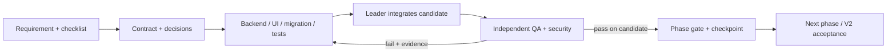

# ทีม Agent สำหรับพัฒนา V2

จัดทำ 2026-09-22 · สถานะ: **เริ่ม V2-P0 แล้ว** ติดตามงานจริงและหลักฐานที่ [v2-execution](v2-execution/README.md)

อ้างอิง [ROADMAP.md](ROADMAP.md), [V1_BASELINE.md](V1_BASELINE.md), [DECISIONS.md](DECISIONS.md), [checklist ตรวจรับ](V2_ACCEPTANCE_CHECKLIST.md) และ [prompt เริ่มงาน](V2_START_PROMPT.md)

## เป้าหมายและความหมายของการทำงานอัตโนมัติ

Leader รับผิดชอบแตกงาน มอบหมาย ตรวจ dependency รับ feedback ส่งกลับแก้ รวมโค้ด และตรวจหลักฐานจนจบ V2-P0 → V2-P1 → V2-P2 ภายในขอบเขตที่เจ้าของอนุญาต ให้ agent ตัดสินใจด้าน implementation ที่ย้อนกลับได้เอง แต่ไม่เดานโยบายต้นทุน เครดิต ภาษี หรือการเปลี่ยนข้อมูลจริงแทนเจ้าของระบบ

“เสร็จครบ” หมายถึง checklist ที่จำเป็นทุกข้อผ่านบนโค้ดชุดเดียวกัน มีหลักฐานและผู้ตรวจอิสระ ไม่มี known defect ค้างในขอบเขต V2 และ regression ที่เกิดจากงานนี้ การมีหลาย agent หรือ test ผ่านทั้งหมดไม่สามารถพิสูจน์ว่าไม่มี bug ที่ยังไม่ถูกค้นพบได้

เอกสาร OpenAI อธิบายให้ agent หลักประสานงาน subagent ที่รับงานชัดเจน และระวังการแก้ไฟล์พร้อมกัน ข้อเสนอบทบาท/กติกาด้านล่างออกแบบสำหรับ repository นี้ ไม่ใช่ทีมมาตรฐานที่ Codex สร้างให้เองเสมอ [OpenAI Subagents](https://learn.chatgpt.com/docs/agent-configuration/subagents), [Multi-agent](https://developers.openai.com/api/docs/guides/agents-api/multi-agent)

## 1. ทีมที่แนะนำ: 9 บทบาท

| รหัส | บทบาท | รับผิดชอบ | หลักฐานส่งกลับ Leader |
| --- | --- | --- | --- |
| L | Leader / Integrator | คุม scope/checklist/dependency, มอบหมาย, feedback, จัดการ conflict, รวมโค้ด, ทบทวนผล และ release report | task board, decision log, integration revision, สรุปสิ่งที่ผ่าน/ไม่ผ่าน |
| A | Architect / Business Rules | แปลงธุรกิจเป็น state machine/API contract/invariants; นิยามหน่วย ราคา ต้นทุน ลูกหนี้/เจ้าหนี้ และตัวอย่างคำนวณ | approved contract, ตัวอย่าง expected result, รายการนโยบายที่ยังต้องตัดสินใจ |
| I | Backend Inventory / POS | cart/checkout/idempotency, หน่วย, FEFO, lot, reservation, transfers/claims/counts, expiry และ stock ledger | implementation + unit tests + ผลตรวจ stock/lot invariants |
| F | Backend Finance / Sales | customer, quotation/invoice, ขายส่ง/โปร, AR/AP, เช็ค, credit note/refund, เงินสดและรายงาน | implementation + unit tests + ตัวอย่างกระทบยอดเอกสาร/เงิน |
| U | Frontend / UX | หน้าจอและ form ของแต่ละ feature, สิทธิ์ใน UI, loading/empty/error, mobile/desktop, accessibility | หน้าจอใช้ API จริง, component/interaction checks, ภาพ/trace ที่จำเป็น |
| D | Database / Migration | schema, constraint/index, migration ordering, backfill/reconciliation, upgrade V1→V2 และ recovery | migration + dry-run บนข้อมูลจำลอง/สำเนาที่อนุญาต + รายงานก่อน/หลัง |
| T | Test Engineer | ออกแบบ automated tests จาก requirement; integration/property/concurrency/contract และ test fixtures | test IDs ผูก checklist, commands/logs, expected results ที่ไม่ลอกสูตร implementation |
| Q | Independent QA / Reviewer | ตรวจ diff, เล่น flow จริง, exploratory/adversarial testing, mobile/roles, ยืนยัน bug fix | pass/fail พร้อมวิธีทำซ้ำ, expected/actual, revision, screenshots/trace ตามจำเป็น |
| S | Security / DevOps / Release | auth/session/secrets, CI, isolated DB, backup/restore, deployment/recovery/load smoke และ observability | security findings, CI artifacts, restore drill, runbook, release readiness |

ผู้เขียน backend/frontend ต้องเขียน test ที่เหมาะกับงานของตนเอง T ทำการทดสอบข้ามส่วนและกรณีอิสระเพิ่มเติม Q ตรวจรับพฤติกรรมจริงและหาข้อผิดพลาด ไม่ใช่เพียงรัน test ของผู้เขียนแล้วประกาศผ่าน

A เป็นผู้ช่วยจัดกฎธุรกิจ ไม่ใช่ผู้อนุมัตินโยบายบัญชีแทนเจ้าของหรือผู้รับผิดชอบเอกสาร S อาจแยก Security กับ DevOps ในทีมที่มี capacity มากขึ้น แต่ไม่จำเป็นต้องเปิด agent มากขึ้นตั้งแต่ต้น

## 2. จำนวนบทบาทไม่เท่ากับจำนวน agent ที่เปิดพร้อมกัน

ขีดจำกัดของ session ที่จัดทำแผนนี้คือ **4 agent รวม primary** จัดเป็น Leader 1 + worker สูงสุด 3 ไม่อ้างว่าทุก Codex session มีขีดจำกัดเดียวกัน ตอนเริ่มงานตรวจเครื่องมือ/capacity ที่มีจริงอีกครั้ง

| รอบ | Leader ทำอะไร | งานขนานที่เหมาะสม สูงสุด 3 ชุด |
| --- | --- | --- |
| เตรียม Phase | แตก scope/ผูก checklist | A กฎ/contract, D schema impact, Q/T ออกแบบ acceptance cases |
| พัฒนาแต่ละ feature | คุม interface และ integration | I หรือ F ทำ backend, U ทำ UI ตาม contract, T ทำ tests จากตัวอย่างธุรกิจ |
| งานอิสระอีก feature | ตรวจ dependency และไฟล์ที่ไม่ชน | I/F ของอีกโมดูล, D migration ที่ลงทะเบียนแล้ว, S CI/security |
| ตรวจรับ | freeze candidate revision และจัดลำดับแก้ | T ทดสอบอัตโนมัติ, Q ตรวจ UI/flow/diff, S ตรวจ security/recovery |
| แก้ defect | ส่งงานกลับผู้รับผิดชอบและคุมผลกระทบ | author แก้, T เพิ่ม regression, Q ตรวจ fix เมื่อ revision ใหม่พร้อม |

จัดคิวและ reuse worker ตามเครื่องมือที่รองรับ ไม่เปิด agent เพิ่มจนเกิน limit ไม่ให้ subagent แตกทีมต่อเองจน Leader คุม scope ไม่ได้ งานที่รอ contract/migration ต้องรอส่วนที่พึ่งพาได้จริง ไม่ถือว่าเป็นงานขนานเพียงเพราะตั้งชื่อคนละบทบาท

ผู้ตรวจรับฟีเจอร์ต้องไม่เป็นผู้เขียน implementation ของฟีเจอร์เดียวกัน หาก worker ถูก reuse ให้ย้ายบทบาทตรวจไปอีก worker และส่ง acceptance cases/หลักฐานต้นฉบับให้ ไม่ส่งเพียงข้อสรุปว่า “ผู้เขียนทดสอบผ่านแล้ว”

## 3. การแบ่งพื้นที่ทำงาน

- Shared workspace: Leader ลงทะเบียนเจ้าของไฟล์ก่อน ทุกไฟล์มี writer เดียวในเวลาเดียวกัน Reader อ่านได้ แต่ไม่แก้แทรก ถ้าจำเป็นต้องแตะไฟล์นอก scope ส่งเหตุผลให้ Leader จัดคิว
- Separate worktrees ใช้เมื่อมี implementation ที่แยกกันจริง ต้องสร้างและกำหนด path ให้ชัด ไม่ถือว่า spawn agent แล้วได้ worktree อัตโนมัติ และต้องนำเอกสาร V2 ที่ยังไม่ commit เข้า baseline งานก่อนเริ่มจาก worktree
- Leader ถือสิทธิ์ integration files เช่น `backend/internal/http/server.go`, shared types/contracts, `frontend/src/services/erp.ts`, shared UI และ migration registration เว้นแต่โอน ownership ชั่วคราว
- D จองเลข migration ตาม repository HEAD ตอนเริ่มจริง ห้ามหลาย agent เลือกเลขถัดไปเอง ห้ามแก้ migration ที่ deploy แล้วเพื่อให้ test ผ่าน
- Integration writer คนเดียวทำ merge/cherry-pick ถ้าต้องใช้; รักษางานเดิมของผู้ใช้และ untracked `docs/qa/` ไม่ใช้ reset/clean เพื่อแก้ conflict
- DB/port/build directory/test namespace แยกตามงานที่เขียนพร้อมกัน มีเพียง runner ที่ได้รับมอบหมายเขียน shared test DB ไม่ migrate/reset DB ที่ร้านใช้
- ไม่ให้สอง agent รัน build ทับ `.next` ที่ server หรือ E2E กำลังใช้อยู่

## 4. วงจรควบคุมงานของ Leader

1. ตรวจ HEAD, working tree, project instructions, V1 regression และ environment; ระบุสิ่งที่มีอยู่แล้วก่อนออกงาน
2. แตก checklist เป็นงานย่อยขนาดหนึ่ง flow ที่ตรวจจบได้ ระบุ prerequisite, acceptance, owner และ reviewer
3. A สรุป contract และตัวอย่างธุรกิจ; ปิดเฉพาะ decision ที่เป็น prerequisite ของงานนั้น งานอิสระดำเนินต่อได้ระหว่างรอ
4. D เตรียม schema เมื่อจำเป็น จากนั้นให้ implementation และ tests/UI ที่อิสระกันทำงานขนาน
5. รับรายงาน subagent ตรวจ diff/ผลทดสอบจริง ไม่ยอมรับ “done” ที่ไม่มีหลักฐาน และไม่สรุปจากภาพหน้าจออย่างเดียว
6. รวมโค้ดที่เข้ากันได้เป็น candidate revision จากนั้น T/Q/S ตรวจ candidate เดียวกันก่อนเปลี่ยน checklist
7. Findings กลับถึง author พร้อม task ID, reproduction และเกณฑ์แก้ไข; เพิ่ม regression สำหรับ defect ที่มีนัยสำคัญ
8. ยืนยัน fix แล้วทดสอบส่วนที่กระทบซ้ำ ถ้าแก้ shared contract/schema ให้ทบทวนทุก consumer ที่เกี่ยวข้อง ผลจาก revision เก่าไม่ยืนยัน revision ใหม่
9. จบ Phase เมื่อรายการที่จำเป็นผ่านทั้งหมด แล้วอัปเดต checkpoint และเริ่ม Phase ถัดไป
10. ก่อนประกาศ V2 เสร็จ ทำ integrated regression/migration/restore/UAT บน revision ส่งมอบ และออก release report ที่แยก verified, blocked และข้อจำกัดชัดเจน

หากแก้ defect ซ้ำ 3 รอบโดยยังไม่เข้าใจเหตุ ให้ Leader เปลี่ยนเป็น root-cause investigation และใช้ reviewer อีกคนช่วย ไม่วนแก้สุ่ม ไม่ลด assertions หรือเปลี่ยนผลคาดหวังเพื่อให้เขียว



## 5. Task packet และรูปแบบ feedback

Leader ส่งข้อมูลนี้ทุกงาน ไม่ส่งคำสั่งกว้างเพียง “ทำ backend V2 ให้เสร็จ”:

```text
Task ID / checklist IDs:
Role / objective:
Base revision / workspace path:
Prerequisites / approved decisions:
Allowed files / forbidden concurrent edits:
API/schema contract:
Business examples + expected results:
Acceptance tests + environments:
Required outputs: changed files, actual commands/results, evidence paths,
                  remaining risks, blockers and handoff for next owner.
Boundary: do not expand scope, overwrite other work, lower test gates,
          use production data or deploy beyond existing authorization.
```

ตัวอย่าง Leader ส่งกลับแก้: “V2-P0-04 ไม่ผ่าน: replay remote checkout พร้อมกัน 2 request สร้าง invoice 2 ใบ; คาดหวังใบเดียวและคืนผลเดิม ทดสอบบน revision … ด้วย … แก้ transaction/idempotency เพิ่ม regression สำหรับ concurrent retry แล้วส่งหลักฐานให้ T/Q ตรวจใหม่”

Bug record ต้องมี severity, feature/test ID, revision, environment, steps/fixture, expected/actual, หลักฐาน, ผู้รับผิดชอบ และ regression test ที่ป้องกันกลับมาอีก แยก application defect จาก environment failure; ทั้งสองอย่างทำให้หลักฐานที่จำเป็นยังไม่ผ่านเหมือนกัน

## 6. คำสั่งเฉพาะแต่ละบทบาท

นำคำสั่งสั้นนี้ต่อท้าย task packet; ใช้โมเดลของ parent ตามค่าเริ่มต้น ไม่ต้องกำหนดชื่อโมเดลต่างกันเพื่อให้เป็นคนละบทบาท

| Role | คำสั่งที่ Leader ส่ง |
| --- | --- |
| A | อ่าน requirement และ code ที่เกี่ยวข้อง สรุป state transitions, invariants, API/errors/permissions และตัวอย่างเงิน/หน่วยที่คำนวณอิสระ แจ้งเฉพาะ policy ที่ขาดและงานที่ทำต่อได้ ห้ามเลือกนโยบายบัญชีใหม่แทนเจ้าของ |
| I | พัฒนา flow สต๊อก/POS ตาม contract; ตรวจ base-unit quantities, lot allocation, reservations, expiry และ concurrency แบบ transaction เขียน unit tests พร้อมผล ledger ก่อน/หลัง ไม่คำนวณราคาที่ frontend |
| F | พัฒนา flow ขาย/การเงินตาม contract; ตรวจ precision/rounding, document/payment allocations, due dates, partial payments, reversals และ audit เก็บธุรกรรมต้นฉบับ ห้ามให้ settlement ซ้ำหรือแก้ประวัติเพื่อทำยอดให้ตรง |
| U | ทำหน้าจอที่ใช้ API จริงตาม contract รองรับ permission/loading/empty/error/conflict/retry และ mobile keyboard ตรวจหน่วยและยอดที่แสดง ห้ามใช้ mock ค้างแทน flow ส่งมอบ |
| D | ทำ migration/backfill แบบเก็บหลักฐานและตรวจ constraint ตรวจทั้ง fresh install กับ upgrade จาก V1 ที่มีธุรกรรม ทำ recovery บน DB แยก รายงาน rows/ยอดที่ตรวจ ไม่แตะฐานใช้งานจริง |
| T | ออกแบบ tests จาก acceptance และ expected fixtures อิสระ ทดสอบเงินจริง/stock calculation ด้วยระบบจริงใน DB แยก รวม duplicate/out-of-order/concurrent/failure rollback และรวบรวม evidence ห้ามอ้าง skipped test ว่าผ่าน |
| Q | ตรวจ candidate ที่รวมแล้วโดยไม่แก้ production code เอง เล่น journey ตามบทบาทบน UI/API จริง ตรวจ diff และหา edge cases ส่ง findings ที่ reproduce ได้ อย่าอนุมัติจากรายงานผู้เขียนอย่างเดียว |
| S | ตรวจ auth/session/branch boundaries/secrets, CI/isolation, backup restore, migrations/recovery และ failure visibility ใช้ environment ที่อนุญาต รายงานความพร้อมพร้อมหลักฐาน ห้าม deploy โดยไม่มีขอบเขตอนุญาต |
| L | จัดคิวตาม dependency/capacity ตรวจ evidence และไฟล์ชนกัน ให้ feedback เฉพาะจุด ส่งกลับแก้/รวม/ทดสอบซ้ำจน gate ผ่าน คง checklist และ checkpoint ให้ตรงจริง ไม่ประกาศจบเพื่อให้ครบกำหนดหรือเพราะ agent ทุกตัวตอบ done |

## 7. ทำงานต่อเนื่องข้าม session

Prompt เดียวไม่รับประกันการทำงานไม่หยุดเมื่อ usage หมด, session ถูกขัดจังหวะ, credentials ขาด หรือ decision สำคัญยังไม่มีคำตอบ บันทึกงานลง repository เพื่อ resume ได้ ไม่ใช่ให้ agent พยายามจำแผนทั้งหมดในแชท

เมื่อเริ่ม implementation ให้ Leader สร้าง `docs/versions/v2-execution/` สำหรับ task board, decisions, bugs และ checkpoint และใช้ artifact/log directory ที่เหมาะสมสำหรับหลักฐานทดสอบ โดยไม่ใส่ secret หรือข้อมูลลูกค้าจริงใน Git

Checkpoint ประกอบด้วย integration revision, dirty files และเจ้าของ, tasks ที่ผ่าน/กำลังทำ/blocked, test run IDs, decision ที่ยังขาด, environment ที่ใช้ และงานถัดไป เมื่อ resume ต้องตรวจ working tree เทียบ checkpoint ก่อน ไม่รัน migration/checkout/payment ซ้ำโดยอาศัยข้อความว่า “น่าจะยังไม่ทำ”

ข้อมูลที่จำเป็นและยังไม่กำหนดให้ถามเป็นชุดตั้งแต่ต้น เช่น FIFO หรือ Moving Average, กฎเครดิต/เช็ค/ใบลดหนี้, นโยบายโปร, นิติบุคคลและการเปิด Pro หากมีคำตอบที่อนุญาตไว้แล้วให้ใช้ต่อโดยไม่ถามซ้ำ งานที่ไม่ขึ้นกับคำตอบดำเนินต่อได้

ไม่ตั้ง automation, สร้าง recurring job หรือปรับ config ของ Codex จากเอกสารแผนนี้เอง การทำงานต่อภายหลังต้องอยู่ในขอบเขตการรันและการอนุญาตของผู้ใช้จริง

## 8. เกณฑ์ส่งมอบ

- Checklist ทุกข้อที่จำเป็นมี implementation, test/evidence และ independent verification; ข้อที่ยังไม่ทราบนโยบายถือว่า blocked ไม่ติ๊กผ่าน
- ไม่มี bug ที่ค้นพบแล้วยังค้างใน V2 หรือ regression จาก V2; หากข้อใดต้องเลื่อน ต้องบอกว่าขอบเขต V2 เปลี่ยนและยังไม่ครบตามฉบับนี้
- Required build/type/lint/unit/integration/E2E/migration/recovery checks ผ่านบน revision ส่งมอบ; final core checkout/stock/payment tests ไม่ mock mutation ที่กำลังพิสูจน์
- ไม่ใช้ 100% line coverage, จำนวน agents หรือคะแนนความมั่นใจของ AI เป็นหลักฐานว่าไม่มี bug
- ผู้ใช้จริงตรวจ UAT ที่ต้องมี business sign-off; ถ้ายังไม่มีผลรายงานได้เพียง implementation/technical verification complete ไม่ใช่ released
- ส่ง `V2_RELEASE.md` พร้อม commit, migrations, decision versions, test evidence, deployment/recovery runbook และสิ่งที่ยังไม่ได้ยืนยันใน production

เอกสารนี้เสนอวิธีทำงานและเกณฑ์รับงาน ไม่ยืนยันว่า V2 พัฒนาเสร็จ และยังไม่มีการสร้าง subagent หรือเปลี่ยน runtime/config เพื่อเริ่มงาน
